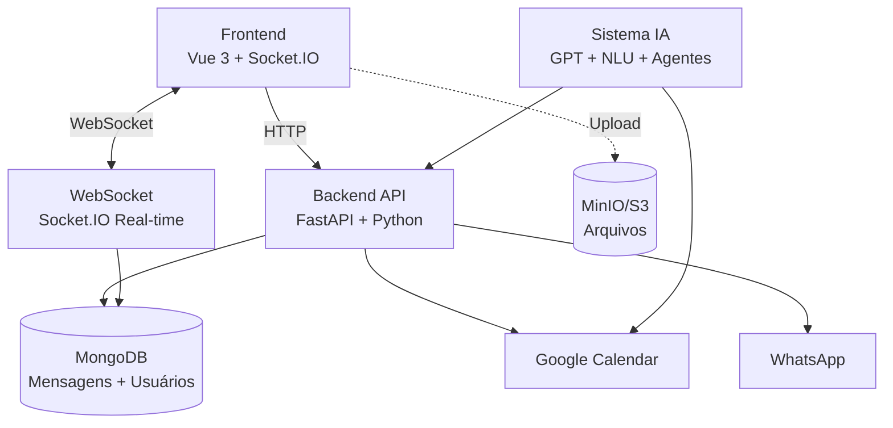

# 🏗️ Arquitetura do Sistema - Chat App

## 📋 Visão Geral

Sistema de chat em tempo real com IA híbrida, integrações omnichannel e agendamento automático via Google Calendar.

## 🗺️ Diagrama de Arquitetura



## 🧩 Componentes Principais

### 1️⃣ Frontend (Vue 3 + TypeScript)

**Localização:** `/frontend/src`

**Stack Tecnológica:**
- **Vue 3.5.22** - Composition API
- **TypeScript 5.7** - Type Safety
- **Vuetify 3.10.8** - UI Components
- **Pinia** - State Management
- **Socket.IO Client 4.8** - Real-time Communication
- **Vite 7.1** - Build Tool
- **Animate.css** - Animations

**Estrutura:**
```
frontend/src/
├── design-system/         # Sistema de design reutilizável
│   ├── components/        # DSChatHeader, DSMessageBubble, etc
│   ├── tokens/           # Cores, espaçamentos, tipografia
│   ├── styles/           # Foundations, mixins, utilities
│   ├── composables/      # Lógica reutilizável
│   └── types/           # TypeScript types
├── features/             # Organização por domínio
│   ├── agents/          # AgentChatPane, SlotPicker
│   ├── chat/            # MessageList, TypingIndicator
│   ├── contacts/        # ContactsList
│   ├── handover/        # HandoverQueue
│   └── whatsapp/        # WppConnectDialog
├── stores/              # Pinia stores
│   ├── auth.ts          # Autenticação JWT
│   ├── chat.ts          # Mensagens e conversas
│   └── contacts.ts      # Lista de contatos
├── composables/         # useOmni, useUpload, useHandover
└── views/              # ChatView, LoginView, ChatLayoutView
```

**Features:**
- ✅ Design System WhatsApp-style
- ✅ Upload de arquivos (drag-and-drop)
- ✅ Chat em tempo real com typing indicators
- ✅ Sistema de agentes IA (floating windows)
- ✅ Calendário visual para agendamento
- ✅ Sistema de handover bot→humano
- ✅ Integração WhatsApp Web
- ✅ Responsivo (mobile-first)

---

### 2️⃣ Backend (FastAPI + Python 3.11)

**Localização:** `/backend`

**Stack Tecnológica:**
- **FastAPI 0.115** - Web Framework
- **Python-SocketIO 5.13** - WebSocket Server
- **Motor 3.7** - Async MongoDB Driver
- **PyJWT** - JWT Authentication
- **Bcrypt** - Password Hashing
- **Boto3** - AWS S3/MinIO Client
- **OpenAI API** - GPT Integration
- **Google Calendar API** - Agendamento

**Estrutura:**
```
backend/
├── main.py                 # FastAPI app + Socket.IO
├── socket_manager.py       # Socket.IO singleton
├── socket_handlers.py      # Eventos real-time
├── database.py            # MongoDB collections
├── models.py              # Pydantic models
├── auth.py                # JWT + bcrypt
├── storage.py             # MinIO/S3 uploads
├── deps.py                # Dependências FastAPI
├── bots/                  # Sistema de IA
│   ├── core.py           # BaseBot
│   ├── ai_bot.py         # GPT conversation
│   ├── agents.py         # Guru, TechMaster, SDR
│   ├── nlu.py            # Intent detection
│   ├── entities.py       # Entity extraction
│   ├── handover.py       # Bot→Human transfer
│   ├── automations.py    # Scheduled tasks
│   └── commands.py       # Slash commands
├── integrations/         # APIs externas
│   └── google_calendar.py # OAuth2 + Calendar API
├── routers/              # REST endpoints
│   ├── messages.py       # CRUD mensagens
│   ├── uploads.py        # Presigned URLs
│   ├── calendar.py       # Slots disponíveis
│   ├── handovers.py      # Handover API
│   ├── nlu.py            # Análise de texto
│   ├── custom_bots.py    # Bot management
│   ├── automations.py    # Automation rules
│   ├── omni.py           # Omnichannel
│   └── webhooks.py       # Meta/WPP webhooks
├── wpp.py                # WPPConnect integration
├── meta.py               # Meta Graph API
├── contacts.py           # Contact management
├── users.py              # User CRUD
└── transcription.py      # Audio transcription
```

**Features:**
- ✅ Autenticação JWT com refresh tokens
- ✅ Chat real-time via Socket.IO
- ✅ Upload de arquivos com presigned URLs
- ✅ Sistema de IA híbrida (pattern + GPT)
- ✅ NLU: Detecção de intenções (scheduling, purchase, support, legal)
- ✅ Extração de entidades (email, CPF, telefone, datas)
- ✅ Agente SDR com Google Calendar
- ✅ Sistema de handover bot→humano
- ✅ Integração WhatsApp (WPPConnect + Selenium)
- ✅ Integração Facebook Messenger + Instagram
- ✅ Automações agendadas

---

### 3️⃣ Database (MongoDB 7.0)

**Collections:**

```javascript
// users
{
  _id: ObjectId,
  name: string,
  email: string,
  passwordHash: string,
  role: "admin" | "agent" | "customer",
  createdAt: Date
}

// messages
{
  _id: ObjectId,
  author: string,           // user_id
  text: string,
  timestamp: number,        // milliseconds
  attachments?: [{
    type: "image" | "file" | "audio" | "video",
    url: string,
    filename: string,
    size: number
  }],
  channel?: "web" | "whatsapp" | "facebook" | "instagram",
  status?: "sent" | "delivered" | "read"
}

// agent_messages
{
  _id: ObjectId,
  agent_key: string,        // "guru", "sdr", "techmaster"
  author: "user" | "agent",
  text: string,
  timestamp: number
}

// handovers
{
  _id: ObjectId,
  userId: string,
  userName: string,
  userEmail: string,
  reason: string,
  context: string,
  status: "pending" | "accepted" | "in_progress" | "resolved" | "cancelled",
  priority: 1 | 2 | 3 | 4,
  createdAt: Date,
  updatedAt: Date,
  acceptedBy?: string,
  resolvedAt?: Date,
  resolution?: string
}

// custom_bots
{
  _id: ObjectId,
  name: string,
  description: string,
  systemPrompt: string,
  capabilities: string[],
  isActive: boolean,
  createdAt: Date
}
```

---

### 4️⃣ Storage (MinIO/S3)

**Bucket:** `chat-uploads`

**Fluxo de Upload:**

1. Frontend solicita presigned URL: `POST /uploads/presigned-url`
2. Backend gera URL assinada (válida por 5 minutos)
3. Frontend faz upload direto ao MinIO via PUT
4. Upload completo, frontend notifica backend
5. Backend salva referência no MongoDB

**Configuração CORS:**
```json
{
  "AllowedOrigins": ["*"],
  "AllowedMethods": ["GET", "PUT", "POST", "DELETE", "HEAD"],
  "AllowedHeaders": ["*"],
  "ExposeHeaders": ["ETag"],
  "MaxAgeSeconds": 3600
}
```

---

### 5️⃣ Sistema de IA Híbrida

**Arquitetura:**

```
┌─────────────────────┐
│  Cliente conversa   │
└──────────┬──────────┘
           │
           ▼
    ┌─────────────┐
    │  NLU System │ ← Pattern matching + confidence
    └──────┬──────┘
           │
           ├──→ Intent: scheduling → Agente SDR
           ├──→ Intent: purchase → Agente Comercial  
           ├──→ Intent: support → Agente Suporte
           ├──→ Intent: legal → Handover Imediato
           └──→ Intent: general → Guru (GPT)
```

**Agentes Disponíveis:**

1. **Guru** - Assistente geral (GPT-3.5)
2. **TechMaster** - Suporte técnico especializado
3. **SDR** - Qualificação + agendamento automático
4. **Comercial** - Vendas e propostas
5. **Suporte** - Troubleshooting guiado

**NLU (Natural Language Understanding):**
- Detecção de 15+ intenções diferentes
- Confidence score (0-1)
- Keywords matching
- Extração de entidades com regex

**Entidades Suportadas:**
- CPF (validação com dígitos verificadores)
- Email (RFC 5322)
- Telefone (formato brasileiro)
- Datas (DD/MM, DD/MM/YYYY, "amanhã", "segunda")
- Horários (HH:MM, "14h", "2pm")

---

### 6️⃣ Integração Google Calendar

**OAuth2 Flow:**

1. Credenciais em `backend/credentials.json`
2. Primeiro acesso: `./setup-google-calendar.sh`
3. Token salvo em `backend/token.json`
4. Refresh automático quando expira

**Features:**

- ✅ Listar eventos futuros
- ✅ Criar eventos com Google Meet
- ✅ Verificar disponibilidade
- ✅ Buscar slots livres (ex: 9h-18h)
- ✅ Atualizar eventos
- ✅ Cancelar eventos
- ✅ Envio automático de convites por email

**Fluxo de Agendamento Automático:**

```
Cliente: "quero agendar"
    ↓
NLU detecta intent "scheduling"
    ↓
Frontend exibe SlotPicker (calendário visual)
    ↓
Cliente seleciona data + horário
    ↓
Backend cria evento no Google Calendar
    ↓
Cliente recebe confirmação com links (Calendar + Meet)
    ↓
Email enviado automaticamente pelo Google
```

---

### 7️⃣ Integrações Omnichannel

#### WhatsApp

**Método:** WPPConnect + Selenium

- QR Code via screenshot
- Sessão persistente
- Webhook para mensagens
- Envio de mídia
- Status de leitura

**Endpoints:**
- `POST /wpp/start` - Inicia sessão
- `GET /wpp/qrcode` - Obtém QR code
- `POST /wpp/send` - Envia mensagem
- `GET /wpp/status` - Status da conexão

#### Facebook Messenger

**Método:** Meta Graph API

- Webhooks para eventos
- Envio de mensagens
- Templates estruturados
- Quick replies

#### Instagram Messaging

**Método:** Meta Graph API

- Direct messages
- Story replies
- Quick replies

---

## 🔄 Fluxos de Dados Principais

### 1. Envio de Mensagem

```
Frontend (Vue)
    ↓ socket.emit('chat:send', {...})
Socket.IO Server
    ↓ Valida + Salva no MongoDB
    ↓ socket.emit('chat:new-message', {...})
Todos os Clientes Conectados
```

### 2. Upload de Arquivo

```
Frontend
    ↓ POST /uploads/presigned-url
Backend (gera URL assinada)
    ↓ Retorna {url, key}
Frontend
    ↓ PUT direto ao MinIO
MinIO/S3
    ↓ Upload completo
Frontend
    ↓ Notifica backend via Socket.IO
Backend
    ↓ Salva referência no MongoDB
```

### 3. Detecção de Intenção + Agendamento

```
Cliente conversa com SDR
    ↓
Backend: detect_intent(conversation_text)
    ↓ Intent: "scheduling" + confidence > 0.5
    ↓ Entidade: email presente, data ausente
Backend: socket.emit('agent:show-slot-picker')
    ↓
Frontend exibe SlotPicker
    ↓
Cliente seleciona slot
    ↓ socket.emit('chat:send', "Escolhi dia X às Y")
Backend: sdr_try_schedule_meeting()
    ↓ Cria evento no Google Calendar
    ↓ Obtém links (Calendar + Meet)
Backend: Confirma com o cliente
    ↓
Google envia email automaticamente
```

### 4. Handover Bot→Humano

```
Bot detecta necessidade de handover
    ↓ POST /handovers/
Backend cria registro com priority 1-4
    ↓ socket.emit('handover:new')
Frontend (HandoverQueue) exibe notificação
    ↓
Agente humano aceita: PUT /handovers/{id}/accept
    ↓ socket.emit('handover:accepted')
Agente resolve: PUT /handovers/{id}/resolve
    ↓ Status: "resolved"
```

---

## 🐳 Docker Compose

**Serviços:**

1. **mongo** - MongoDB 7.0 Replica Set (porta 27017)
2. **mongo-init** - Inicializa replica set
3. **api** - Backend FastAPI (porta 3000)
4. **web** - Frontend Vite (porta 5173)
5. **minio** - Storage S3 (portas 9000/9001)
6. **minio-init** - Cria bucket + CORS
7. **whatsapp-selenium** - WhatsApp Web (porta 21466)

**Volumes:**
- `mongo_data` - Persistência MongoDB
- `minio_data` - Persistência arquivos
- `whatsapp_sessions` - Sessões WhatsApp

---

## 🔐 Segurança

- ✅ JWT Authentication com refresh tokens
- ✅ Bcrypt para hashing de senhas (12 rounds)
- ✅ CORS configurado
- ✅ Presigned URLs (expiração 5 minutos)
- ✅ Validação de tipos de arquivo
- ✅ Limite de tamanho (15MB)
- ✅ OAuth2 para Google Calendar
- ✅ Webhook verification (Meta/WhatsApp)
- ✅ Environment variables para secrets

---

## 📊 Portas e Endpoints

| Serviço | Porta | URL |
|---------|-------|-----|
| Frontend | 5173 | http://localhost:5173 |
| Backend API | 3000 | http://localhost:3000 |
| MongoDB | 27017 | mongodb://localhost:27017 |
| MinIO API | 9000 | http://localhost:9000 |
| MinIO Console | 9001 | http://localhost:9001 |
| WhatsApp Selenium | 21466 | http://localhost:21466 |

---

## 🚀 Comandos Úteis

```bash
# Iniciar projeto
make up

# Reiniciar
make restart

# Logs
docker compose logs api -f
docker compose logs web -f

# Acessar containers
docker compose exec api bash
docker compose exec web sh

# Rebuild
docker compose build --no-cache

# Limpar tudo
make clean
```

---

## 📚 Documentação Adicional

- [DOCUMENTACAO.md](DOCUMENTACAO.md) - Documentação técnica completa
- [docs/HYBRID_AI_SYSTEM.md](docs/HYBRID_AI_SYSTEM.md) - Sistema de IA
- [docs/SLOT_PICKER_SYSTEM.md](docs/SLOT_PICKER_SYSTEM.md) - Agendamento visual
- [docs/UPLOAD_SYSTEM.md](docs/UPLOAD_SYSTEM.md) - Sistema de upload
- [docs/ARCHITECTURE.md](docs/ARCHITECTURE.md) - Diagramas detalhados
- [docs/AUTH_IMPLEMENTATION.md](docs/AUTH_IMPLEMENTATION.md) - Autenticação
- [docs/WHATSAPP_SETUP.md](docs/WHATSAPP_SETUP.md) - Integração WhatsApp
- [.github/copilot-instructions.md](.github/copilot-instructions.md) - Padrões de código

---

## 🎯 Status do Projeto

- ✅ **Autenticação JWT** - Completo
- ✅ **Chat Real-time** - Completo
- ✅ **Upload de Arquivos** - Completo
- ✅ **Sistema de IA Híbrida** - Completo
- ✅ **NLU + Extração de Entidades** - Completo
- ✅ **Agente SDR** - Completo
- ✅ **Google Calendar** - Completo
- ✅ **Agendamento Visual (SlotPicker)** - Completo
- ✅ **Sistema de Handover** - Completo
- ✅ **WhatsApp Integration** - Completo
- ✅ **Design System Responsivo** - Completo
- 🚧 **Meta Integrations** - Em progresso
- 🚧 **Custom Bot Creator** - Em progresso

---

**Última atualização:** Dezembro 2025
