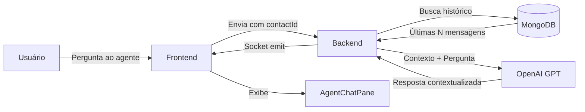

 # 🧠 Agentes com Contexto de Conversa - Plano de Implementação

## 📋 Objetivo

Permitir que agentes IA (Guru, SDR, Advocatus, etc.) interpretem o **histórico da conversa principal** entre o usuário e seus clientes, fornecendo sugestões inteligentes baseadas no contexto.

### Exemplo de Uso:
```
[Chat Principal - Conversa com Cliente]
Cliente: Gostaria de saber mais sobre seus serviços

[Agente @advogado aberto]
Usuário: como responder para esse cliente?
Dr. Advocatus: "Com base na conversa, sugiro: 'Olá! Ficamos felizes com seu 
interesse. Oferecemos 3 planos: Basic, Pro e Enterprise. Qual se adequa melhor 
às suas necessidades?'"

Usuário: o que responder para ele?
Dr. Advocatus: "O cliente parece interessado. Que tal enviar o catálogo em PDF?"

Usuário: sim
Dr. Advocatus: "Histórico mostra que este cliente prefere contato via WhatsApp."
```

---

## 🏗️ Arquitetura da Solução

### 1. Fluxo de Dados



### 2. Componentes Modificados

#### Backend:
- ✅ `bots/agents.py` - Adicionar método `ask_with_context()`
- ✅ `socket_handlers.py` - Buscar histórico antes de enviar ao agente
- ✅ `routers/messages.py` - Endpoint para buscar contexto de conversa
- ⚠️ `models.py` - Já tem `contactId` implementado

#### Frontend:
- ✅ `features/agents/components/AgentChatPane.vue` - Já envia `contactId`
- ⚠️ `stores/chat.ts` - Garantir que `contactId` está sempre disponível

---

## 📝 Implementação Detalhada

### ETAPA 1: Modelo de Dados (✅ JÁ IMPLEMENTADO)

O campo `contactId` já existe em:
- `models.py` - `MessageBase`
- `AgentChatPane.vue` - Props e emit

**Status:** ✅ Completo

---

### ETAPA 2: Backend - Buscar Contexto da Conversa

#### 2.1. Criar Helper para Buscar Histórico

**Arquivo:** `backend/bots/context_loader.py` (CRIAR NOVO)

```python
"""Carrega contexto de conversas para agentes IA."""

from typing import List, Dict, Optional
from datetime import datetime, timedelta
from database import messages_collection


async def get_conversation_context(
    user_id: str,
    contact_id: str,
    limit: int = 20,
    hours_back: int = 24
) -> List[Dict[str, str]]:
    """
    Busca histórico de conversa entre user_id e contact_id.
    
    Args:
        user_id: ID do usuário logado
        contact_id: ID do contato/cliente
        limit: Número máximo de mensagens
        hours_back: Janela de tempo em horas
        
    Returns:
        Lista de mensagens formatadas para GPT:
        [
            {"role": "user", "content": "Olá"},
            {"role": "assistant", "content": "Oi, como posso ajudar?"}
        ]
    """
    # Filtro temporal
    time_threshold = datetime.utcnow() - timedelta(hours=hours_back)
    
    # Query: mensagens entre user_id e contact_id
    query = {
        "$or": [
            {"userId": user_id, "contactId": contact_id},
            {"userId": contact_id, "contactId": user_id}
        ],
        "createdAt": {"$gte": time_threshold},
        # Ignora mensagens de agentes (começam com @)
        "text": {"$not": {"$regex": "^@"}}
    }
    
    cursor = messages_collection.find(query).sort("createdAt", 1).limit(limit)
    docs = await cursor.to_list(length=limit)
    
    # Formata para conversa GPT
    context_messages = []
    for doc in docs:
        # Determina quem falou
        is_user_message = doc.get("userId") == user_id or doc.get("author") == user_id
        role = "assistant" if is_user_message else "user"
        
        # Formata mensagem
        author_name = doc.get("author", "Desconhecido")
        text = doc.get("text", "")
        timestamp = doc.get("createdAt", datetime.utcnow())
        
        content = f"[{timestamp.strftime('%H:%M')}] {author_name}: {text}"
        
        context_messages.append({
            "role": role,
            "content": content
        })
    
    return context_messages


async def format_context_summary(
    user_id: str,
    contact_id: str,
    limit: int = 20
) -> str:
    """
    Gera resumo textual do contexto da conversa.
    
    Args:
        user_id: ID do usuário logado
        contact_id: ID do contato/cliente
        limit: Número máximo de mensagens
        
    Returns:
        String formatada com histórico:
        "CONTEXTO DA CONVERSA PRINCIPAL:
        [14:30] Cliente João: Gostaria de saber mais sobre seus serviços
        [14:31] Você: Olá João! Temos 3 planos disponíveis..."
    """
    messages = await get_conversation_context(user_id, contact_id, limit)
    
    if not messages:
        return "CONTEXTO: Nenhuma conversa recente com este contato."
    
    lines = ["CONTEXTO DA CONVERSA PRINCIPAL (últimas mensagens):"]
    lines.append("-" * 60)
    
    for msg in messages:
        lines.append(msg["content"])
    
    lines.append("-" * 60)
    lines.append(f"Total: {len(messages)} mensagens")
    
    return "\n".join(lines)
```

---

#### 2.2. Modificar `bots/agents.py`

**Adicionar método `ask_with_context()`:**

```python
# Em bots/agents.py, adicionar após o método ask()

async def ask_with_context(
    self,
    message: str,
    user_id: str,
    user_name: str,
    contact_id: Optional[str] = None,
    conversation_context: Optional[List[Dict[str, str]]] = None
) -> str:
    """
    Envia pergunta ao agente COM contexto da conversa principal.
    
    Args:
        message: Pergunta do usuário ao agente
        user_id: ID do usuário
        user_name: Nome do usuário
        contact_id: ID do contato/cliente da conversa
        conversation_context: Histórico da conversa principal
        
    Returns:
        Resposta do agente considerando contexto
    """
    if not self.openai_api_key:
        return f"❌ {self.name} não configurado. Configure OPENAI_API_KEY."
    
    # Prepara mensagens
    messages = [{"role": "system", "content": self.system_prompt}]
    
    # 🆕 ADICIONA CONTEXTO DA CONVERSA PRINCIPAL
    if conversation_context and len(conversation_context) > 0:
        context_intro = {
            "role": "system",
            "content": (
                f"IMPORTANTE: O usuário {user_name} está em uma conversa com um cliente. "
                "Você tem acesso ao HISTÓRICO desta conversa abaixo. "
                "Use este contexto para fornecer sugestões RELEVANTES e ESPECÍFICAS.\n\n"
                "Exemplos de perguntas que você pode receber:\n"
                "- 'como responder para esse cliente?'\n"
                "- 'o que falar agora?'\n"
                "- 'gera um resumo desta conversa'\n"
                "- 'qual o próximo passo?'\n\n"
                "HISTÓRICO DA CONVERSA:"
            )
        }
        messages.append(context_intro)
        
        # Adiciona mensagens do contexto
        messages.extend(conversation_context)
        
        # Separador
        messages.append({
            "role": "system",
            "content": "--- FIM DO CONTEXTO DA CONVERSA ---\n\n"
        })
    
    # Adiciona histórico do próprio agente (conversa interna)
    user_history = self.conversation_history[user_id]
    messages.extend(list(user_history))
    
    # Adiciona pergunta atual
    contextualized_message = f"[Usuário: {user_name}] {message}"
    messages.append({"role": "user", "content": contextualized_message})
    
    try:
        headers = {
            "Authorization": f"Bearer {self.openai_api_key}",
            "Content-Type": "application/json"
        }
        
        if self.openai_account:
            headers["OpenAI-Organization"] = self.openai_account
        
        async with httpx.AsyncClient(timeout=30.0) as client:
            response = await client.post(
                OPENAI_API_URL,
                headers=headers,
                json={
                    "model": OPENAI_MODEL,
                    "messages": messages,
                    "temperature": 0.7,
                    "max_tokens": 600
                }
            )
            
            response.raise_for_status()
            data = response.json()
            
            if "choices" in data and len(data["choices"]) > 0:
                assistant_message = data["choices"][0]["message"]["content"]
                
                # Salva no histórico do agente
                user_history.append({"role": "user", "content": contextualized_message})
                user_history.append({"role": "assistant", "content": assistant_message})
                
                return assistant_message.strip()
            
            return f"❌ {self.name}: Resposta inesperada da API."
    
    except httpx.HTTPStatusError as e:
        return f"❌ {self.name}: Erro API ({e.response.status_code})"
    except Exception as e:
        return f"❌ {self.name}: Erro ao processar - {str(e)}"
```

---

#### 2.3. Modificar `socket_handlers.py`

**Atualizar handler `handle_agent_message()`:**

```python
# Em socket_handlers.py, modificar handle_agent_message()

@sio.on("agent:send")
async def handle_agent_message(sid, data):
    """Handler para mensagens enviadas aos agentes IA."""
    print(f"📨 [Agent] Mensagem recebida de {sid}: {data}")
    
    agent_key = data.get("agentKey")
    message = data.get("message", "").strip()
    user_id = data.get("userId")
    user_name = data.get("userName", "Usuário")
    contact_id = data.get("contactId")  # 🆕 ID do contato da conversa
    
    if not agent_key or not message or not user_id:
        await sio.emit("agent:error", {
            "error": "Dados inválidos"
        }, to=sid)
        return
    
    from bots.agents import AGENTS
    
    agent = AGENTS.get(agent_key)
    if not agent:
        await sio.emit("agent:error", {
            "error": f"Agente '{agent_key}' não encontrado"
        }, to=sid)
        return
    
    try:
        # 🆕 BUSCA CONTEXTO DA CONVERSA SE contact_id FORNECIDO
        conversation_context = None
        if contact_id:
            from bots.context_loader import get_conversation_context
            
            print(f"🔍 [Agent] Buscando contexto: user={user_id}, contact={contact_id}")
            conversation_context = await get_conversation_context(
                user_id=user_id,
                contact_id=contact_id,
                limit=20,  # Últimas 20 mensagens
                hours_back=24  # Últimas 24 horas
            )
            print(f"✅ [Agent] Contexto carregado: {len(conversation_context)} mensagens")
        
        # 🆕 USA ask_with_context() SE HOUVER CONTEXTO
        if conversation_context:
            response_text = await agent.ask_with_context(
                message=message,
                user_id=user_id,
                user_name=user_name,
                contact_id=contact_id,
                conversation_context=conversation_context
            )
        else:
            # Fallback para método original
            response_text = await agent.ask(
                message=message,
                user_id=user_id,
                user_name=user_name
            )
        
        # Salva mensagens no banco
        from database import agent_messages_collection
        from datetime import datetime
        
        # Mensagem do usuário
        user_msg_doc = {
            "agentKey": agent_key,
            "userId": user_id,
            "contactId": contact_id,  # 🆕 Vincula à conversa
            "author": user_name,
            "text": message,
            "role": "user",
            "createdAt": datetime.utcnow()
        }
        await agent_messages_collection.insert_one(user_msg_doc)
        
        # Resposta do agente
        agent_msg_doc = {
            "agentKey": agent_key,
            "userId": user_id,
            "contactId": contact_id,  # 🆕 Vincula à conversa
            "author": agent.get_display_name(),
            "text": response_text,
            "role": "assistant",
            "createdAt": datetime.utcnow()
        }
        await agent_messages_collection.insert_one(agent_msg_doc)
        
        # Emite resposta
        await sio.emit("agent:message", {
            "agentKey": agent_key,
            "contactId": contact_id,  # 🆕 Para filtro no frontend
            "author": agent.get_display_name(),
            "text": response_text,
            "timestamp": int(datetime.utcnow().timestamp() * 1000)
        }, to=sid)
        
        print(f"✅ [Agent] Resposta enviada: {agent_key} para user {user_id}")
    
    except Exception as e:
        print(f"❌ [Agent] Erro ao processar: {e}")
        import traceback
        traceback.print_exc()
        
        await sio.emit("agent:error", {
            "error": f"Erro ao processar: {str(e)}"
        }, to=sid)
```

---

### ETAPA 3: Frontend - Enviar contactId

#### 3.1. Modificar `AgentChatPane.vue`

**Atualizar método `send()`:**

```typescript
// Em AgentChatPane.vue, modificar método send()

function send() {
  const text = input.value.trim();
  if (!text) return;

  const authStore = useAuthStore();
  const userName = authStore.user?.name || 'Você';

  console.log(`📤 [AgentPane ${props.agentKey}] Enviando com contexto:`, {
    text,
    contactId: props.contactId
  });

  // 🆕 Emite para socket "agent:send" com contactId
  chatStore.socket?.emit('agent:send', {
    agentKey: props.agentKey,
    message: text,
    userId: chatStore.currentUser,
    userName: userName,
    contactId: props.contactId  // 🆕 Inclui ID do contato
  });

  // Adiciona mensagem localmente
  messages.value.push({
    author: userName,
    text: text
  });

  input.value = '';
  scrollToBottom();
}
```

---

#### 3.2. Garantir contactId no ChatView

**Arquivo:** `frontend/src/views/ChatView.vue`

Verificar se ao abrir agente, o `contactId` está sendo passado:

```typescript
// Em ChatView.vue, no método que abre agentes

function openAgent(agentKey: string) {
  const currentContactId = chatStore.currentContact?.id;  // ID do contato atual
  
  if (!currentContactId) {
    console.warn('⚠️ Agente aberto sem contactId - contexto não disponível');
  }
  
  chatStore.openAgent(agentKey, {
    contactId: currentContactId  // 🆕 Passa contactId
  });
}
```

---

### ETAPA 4: Melhorar System Prompts dos Agentes

#### 4.1. Atualizar Prompts para Usar Contexto

**Arquivo:** `backend/bots/agents.py` (Modificar system_prompts)

**Exemplo - Dr. Advocatus:**

```python
AGENTS = {
    "advogado": Agent(
        name="Dr. Advocatus",
        emoji="⚖️",
        system_prompt="""Você é Dr. Advocatus, um advogado especialista em orientação jurídica.

IMPORTANTE: Você tem acesso ao HISTÓRICO da conversa entre o usuário e seu cliente.
Use este contexto para fornecer sugestões ESPECÍFICAS e RELEVANTES.

Quando o usuário perguntar:
- "como responder?" → Analise o histórico e sugira uma resposta adequada
- "o que fazer?" → Identifique o próximo passo baseado no contexto
- "gera resumo" → Crie um resumo da conversa para CRM
- "qual estratégia?" → Sugira abordagem baseada no comportamento do cliente

FORMATO DAS RESPOSTAS:
1. Análise do contexto (breve)
2. Sugestão de resposta ou ação
3. Justificativa (opcional)

Seja DIRETO e PRÁTICO. Não repita o histórico, apenas use-o para contextualizar.

Especialidades: Direito civil, contratos, consultas jurídicas gerais.
""",
        # ... resto do agente
    ),
    
    "sdr": Agent(
        name="Agente SDR",
        emoji="📊",
        system_prompt="""Você é um SDR (Sales Development Representative) especialista em qualificação de leads.

IMPORTANTE: Você tem acesso ao HISTÓRICO da conversa de vendas.
Use este contexto para:
- Identificar interesse do lead
- Detectar objeções
- Sugerir próximos passos na jornada de vendas
- Propor agendamentos quando apropriado

Quando o usuário perguntar:
- "como responder?" → Analise o nível de interesse e sugira abordagem
- "tá quente?" → Avalie se lead está pronto para avançar
- "o que mandar?" → Sugira conteúdo (catálogo, case, demo)
- "agendar?" → Proponha horários se detectar momento certo

FORMATO:
1. Status do lead (frio/morno/quente)
2. Sugestão de ação
3. Próximo passo recomendado

Seja estratégico e focado em CONVERSÃO.
""",
        # ... resto do agente
    )
}
```

---

### ETAPA 5: Testing & Validação

#### 5.1. Casos de Teste

**Teste 1: Agente sem contexto**
```
1. Abrir chat sem selecionar contato
2. Abrir agente @guru
3. Perguntar: "como responder?"
4. ✅ Espera: Agente responde genericamente (sem contexto específico)
```

**Teste 2: Agente com contexto**
```
1. Abrir conversa com cliente "João"
2. Trocar 5 mensagens
3. Abrir agente @advogado
4. Perguntar: "como responder para esse cliente?"
5. ✅ Espera: Agente analisa histórico e sugere resposta específica
```

**Teste 3: Múltiplos contatos**
```
1. Conversar com "João" (5 mensagens)
2. Conversar com "Maria" (3 mensagens)
3. Voltar para "João"
4. Abrir @sdr e perguntar: "qual o status?"
5. ✅ Espera: Agente analisa conversa de João (não Maria)
```

**Teste 4: Comandos específicos**
```
1. Conversar com cliente
2. Abrir @advogado
3. Testar comandos:
   - "gera resumo desta conversa"
   - "o que responder?"
   - "qual próximo passo?"
   - "identifica objeções"
4. ✅ Espera: Respostas contextualizadas
```

---

## 📊 Checklist de Implementação

### Backend:
- [ ] **Criar** `backend/bots/context_loader.py`
  - [ ] Função `get_conversation_context()`
  - [ ] Função `format_context_summary()`
  - [ ] Testes unitários

- [ ] **Modificar** `backend/bots/agents.py`
  - [ ] Adicionar método `ask_with_context()`
  - [ ] Atualizar system_prompts dos agentes
  - [ ] Adicionar exemplos de uso nos prompts

- [ ] **Modificar** `backend/socket_handlers.py`
  - [ ] Atualizar `handle_agent_message()`
  - [ ] Buscar contexto quando `contactId` presente
  - [ ] Salvar `contactId` nas mensagens do agente

- [ ] **Criar** `backend/tests/test_context_loader.py`
  - [ ] Testar busca de contexto
  - [ ] Testar formatação de mensagens
  - [ ] Testar filtros temporais

### Frontend:
- [ ] **Modificar** `frontend/src/features/agents/components/AgentChatPane.vue`
  - [ ] Atualizar `send()` para enviar via `agent:send`
  - [ ] Garantir `contactId` no payload
  - [ ] Adicionar indicador visual de "contexto ativo"

- [ ] **Modificar** `frontend/src/views/ChatView.vue`
  - [ ] Passar `contactId` ao abrir agentes
  - [ ] Validar que contactId existe
  - [ ] Mostrar warning se contexto indisponível

- [ ] **Adicionar** UI Feedback
  - [ ] Badge "Contexto ativo" no header do agente
  - [ ] Tooltip explicando funcionalidade
  - [ ] Mensagem quando contexto vazio

### Testing:
- [ ] Teste unitário - `context_loader.py`
- [ ] Teste integração - Socket com contexto
- [ ] Teste E2E - Fluxo completo usuário→agente→resposta
- [ ] Teste múltiplos contatos simultâneos
- [ ] Teste performance (limite de 20 mensagens)

### Documentação:
- [ ] Atualizar `docs/HYBRID_AI_SYSTEM.md`
- [ ] Adicionar exemplos de uso
- [ ] Documentar limitações (24h, 20 msgs)
- [ ] Screenshots da funcionalidade

---

## 🚀 Ordem de Implementação Recomendada

### Sprint 1 - Backend Core (2-3 dias)
1. Criar `context_loader.py` com funções de busca
2. Adicionar `ask_with_context()` em `agents.py`
3. Modificar `socket_handlers.py`
4. Testes unitários básicos

### Sprint 2 - Frontend Integration (1-2 dias)
1. Atualizar `AgentChatPane.vue`
2. Modificar `ChatView.vue`
3. Adicionar indicadores visuais
4. Testar fluxo E2E

### Sprint 3 - Refinamento (1 dia)
1. Melhorar system prompts
2. Adicionar comandos especiais ("gera resumo", "identifica objeções")
3. Performance optimization
4. Documentação completa

### Sprint 4 - Advanced Features (opcional)
1. Cache de contexto (Redis)
2. Análise de sentimento
3. Sugestões proativas
4. Exportar resumo para CRM

---

## 💡 Funcionalidades Avançadas (Futuro)

### 1. Sugestões Proativas
Agente detecta contexto e sugere ações automaticamente:
```
🤖 Dr. Advocatus: "Notei que o cliente mencionou 'contrato'. 
    Deseja que eu sugira cláusulas padrão?"
```

### 2. Análise de Sentimento
```
🤖 Agente SDR: "Cliente demonstra frustração nas últimas 3 mensagens.
    Recomendo abordagem mais empática."
```

### 3. Exportar para CRM
```
Usuário: "gera resumo para crm"
🤖 Agente: "Resumo gerado:
    - Lead: João Silva
    - Interesse: Plano Enterprise
    - Objeções: Preço
    - Próximo passo: Enviar proposta comercial
    - Probabilidade de fechamento: 75%"
```

### 4. Multi-Agent Collaboration
```
🤖 SDR: "Detectei questão técnica. Deseja que eu consulte @techmaster?"
Usuário: "sim"
🤖 TechMaster: "Baseado na dúvida do cliente sobre API, sugiro..."
```

---

## ⚠️ Considerações Importantes

### Segurança:
- ✅ Validar permissões (usuário só vê conversas próprias)
- ✅ Sanitizar dados antes de enviar ao GPT
- ✅ Limitar tamanho do contexto (custo API)
- ✅ Não enviar dados sensíveis (CPF, senhas)

### Performance:
- ✅ Cache de contexto (Redis) para conversas ativas
- ✅ Limitar janela temporal (24h)
- ✅ Limitar número de mensagens (20)
- ✅ Async loading do contexto

### UX:
- ✅ Indicador visual de "contexto ativo"
- ✅ Explicar funcionalidade no onboarding
- ✅ Fallback quando contexto vazio
- ✅ Loading state ao buscar histórico

### Custos OpenAI:
- ⚠️ Contexto aumenta tokens consumidos
- ✅ Implementar limite de mensagens
- ✅ Cache de respostas similares
- ✅ Usar GPT-3.5 (mais barato) quando suficiente

---

## 📈 Métricas de Sucesso

- **Adoção**: % de conversas com agentes usando contexto
- **Satisfação**: Rating das sugestões dos agentes
- **Eficiência**: Redução no tempo de resposta ao cliente
- **Conversão**: % de leads que avançam no funil após uso do agente
- **Custo**: Tokens GPT consumidos vs. valor gerado

---

## 🎯 Resumo Executivo

**Problema:** Agentes IA não têm contexto da conversa principal, limitando utilidade.

**Solução:** Integrar histórico de conversa (últimas 20 msgs, 24h) no prompt do agente.

**Benefícios:**
- ✅ Sugestões específicas e relevantes
- ✅ Redução de tempo de resposta
- ✅ Aumento de conversão
- ✅ Melhor experiência do usuário

**Esforço:** ~5 dias de desenvolvimento (backend + frontend + testes)

**Complexidade:** Média (requer mudanças em 6 arquivos, novos testes)

**ROI Estimado:** Alto (feature diferencial, aumenta valor percebido do produto)

---

## 📚 Referências

- [OpenAI Chat Completions](https://platform.openai.com/docs/guides/chat)
- [Context Window Management](https://help.openai.com/en/articles/4936856)
- [Socket.IO Rooms](https://socket.io/docs/v4/rooms/)
- [MongoDB Text Search](https://www.mongodb.com/docs/manual/text-search/)

---

**Data:** 05/12/2025  
**Status:** 📝 Planejamento  
**Prioridade:** 🔥 Alta  
**Responsável:** [Definir]
